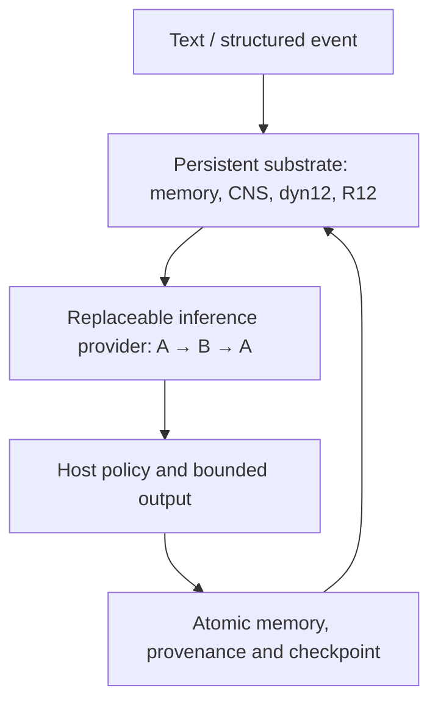

# THE BEAST BOX

> A local-first, inspectable adaptive-agent runtime and experimental integration platform with persistent memory, software state, routing, provenance, and authority boundaries outside replaceable inference models.

[](https://github.com/NavisWORLD/The-beast-box-/actions/workflows/product-ci.yml)
[Releases](https://github.com/NavisWORLD/The-beast-box-/releases) · [Combined kit / EnD](kits/BEAST_BOX_COMBINED/EnD) · [Source map](docs/ECOSYSTEM_MANIFEST.json) · [Security](SECURITY.md) · [Evidence](docs/EVIDENCE_INDEX.md)

**Python 3.10–3.12. No IBM account, cloud credential, GPU, or language model is required for the deterministic reference path.** Source visibility does not grant a license: see [LICENSE](LICENSE).

## What the model does

The language model supplies inference: it receives selected context and returns text or a bounded tool request. Memory, CNS/software state, R12 context routing, Hebbian associations, provenance and continuity checkpoints belong to the runtime. A provider change replaces inference without replacing those stores.



**MODEL ≠ SUBSTRATE. MODEL REPLACEMENT ≠ AUTHORITY TRANSFER. PERSISTENCE ≠ CONSCIOUSNESS.**

## Run locally

```bash
git clone --branch integration/beast-box-portable-kit-002 https://github.com/NavisWORLD/The-beast-box-.git
cd The-beast-box-
git switch integration/beast-box-system-closure-001
python -m venv .venv
# Linux/macOS: source .venv/bin/activate
# Windows: .venv\Scripts\activate
python -m pip install -e .
beastbox runtime init --data-dir ./my-beast
beastbox runtime chat "Remember the sunflower code is marigold" --data-dir ./my-beast
beastbox runtime chat "What is the sunflower code?" --data-dir ./my-beast
beastbox runtime inspect --data-dir ./my-beast
```

Each command starts a new process. `inspect` validates the checkpoint chain and memory/association digest and reports persistent system ID, memory counts, state hash and provenance head. Missing or corrupt required state fails closed. A failed provider call rolls back the entire turn. `ReferenceTextProvider` is a deterministic text fixture, **not a pretrained language model**.

For an already installed model served by local Ollama:

```bash
beastbox runtime chat "Recall the sunflower code" --data-dir ./my-beast \
  --provider ollama --model YOUR_INSTALLED_MODEL --url http://127.0.0.1:11434
```

Run again with another installed model, then the original model. Keep the same `--data-dir`. Configured provider labels are recorded; this interactive path does not attest model-weight hashes. Exact frozen-model identities belong to the separate historical experiment below. HTTP adapters reject non-loopback endpoints, URL credentials, redirects and environment proxies.

The existing [COSMIC.CYPHER](docs/COSMIC_CYPHER.md) tooling also supports GGUF, LM Studio and llama.cpp. Its conversation/coding persistence is a separate legacy surface; use `beastbox runtime` for the transactional continuity contract described here.

## Sensors, tools and recovery

```bash
beastbox runtime sensor-demo --data-dir ./my-beast
beastbox runtime tool-demo --data-dir ./my-beast
beastbox runtime tool-demo --allow-simulated-tool --data-dir ./my-beast
beastbox runtime backup ./beast-backup.sqlite3 --data-dir ./my-beast
beastbox runtime restore ./beast-backup.sqlite3 --sha256 BACKUP_HASH --data-dir ./recovered-beast
beastbox runtime inspect --data-dir ./recovered-beast
```

The first tool demo is denied. The second permits only a numeric simulated position update; it has no physical, shell, credential or network authority. Permission is supplied by the host for that invocation and is never restored from memory. Normalized events accept text and up to 16 finite numeric features in `[-1, 1]`, with explicit synthetic provenance. They do not capture audio, cameras or people.

Back up through the CLI so SQLite WAL data is included. Restore requires a verified hash and a fresh directory, validates the copied checkpoint, and never overwrites existing history. Retain the backup hash separately. Hashes detect corruption; they are not signatures and cannot defeat a host that rewrites both data and receipts.

## What was verified

The separate frozen-model experiment **002 historical-4e53** recorded real Model A → Model B → Model A inference with the same hash-tracked substrate, cross-swap memory delivery, state accumulation, zero model-parameter drift, and A-only, empty-memory and shuffled-memory controls.

- [Final report and precise interpretation](docs/PERSISTENT_SUBSTRATE_MODEL_SWAP_002_FINAL_REPORT.md)
- [Executed source bd4108a](https://github.com/NavisWORLD/The-beast-box-/commit/bd4108ac2f245262a25fd80463e84d9279eeead2)
- [Successful run 33914200592](https://github.com/NavisWORLD/The-beast-box-/actions/runs/33914200592)
- Model A checkpoint SHA-256: `454f3017618a81fb9a13393b215d448f365534baf5b607e19d1438955921e425`
- Model B: `HuggingFaceTB/SmolLM2-135M@4e53f736cbb20a9a0f56b4c4bf378d9f306ff915`
- Classification: `COMPLETED_DESCRIPTIVE_MEASUREMENT`

Verify the preserved ZIP without rerunning expensive inference:

```bash
beastbox runtime verify-swap-receipt evidence/system-closure-001/historical-swap-002.zip
```

The verifier checks exact archive, manifest and result hashes plus recorded source/run identity and structural gates. The source model/world binaries are external artifacts named in the report; the receipt ZIP does not contain their weights or re-execute their behavior. Successful memory delivery is not a claim of improved semantic recall. Experiment 001's missing seed provenance and the unavailable Model-B revision `816ebadd0c024779e6657fdcfc1ab02bb9a7c473` remain historical failures.

## Product and research boundaries

| Layer | Supported boundary |
| --- | --- |
| COSMOS / CNS / dyn12 | Existing public software-state loop with persistent checkpoints |
| Hebbian / R12 | Existing association updates and context ranking; routing state is software metadata |
| Synapse / HEARTLIGHT | Orchestration and continuity responsibilities mapped onto this runtime; separate formal products remain interfaces/future work |
| Knowledge/world store | Existing experimental R12 world store, separate from the normal conversation database |
| Zeref | Checkpoint and conversation-experiment lineage |
| Bio, entropy, IBM/quantum | Optional research adapters, excluded from the normal durable input path |
| Camera / physical actuators | Not implemented in the supported baseline |

The [machine-readable map](docs/ECOSYSTEM_MANIFEST.json) gives actual source paths and labels. Existing higher-dimensional state variants remain experimental instrumentation. This software does not establish consciousness, sentience, biological life, personal identity, resurrection, a soul, quantum advantage, extra physical dimensions or new physics. Generated prose is not scientific evidence.

The **R12 Reality Memory Expansion** remains documented in the [R12 manual](docs/ZEREF_R12_REALITY_MEMORY_MANUAL.md). Its historical phrase **forever memory** describes a retention goal for owner-maintained durable records, not guaranteed indefinite storage or biological continuity.

Historical classifications remain `ENGINEERING_ISOLATION_VERIFIED_CAUSAL_RESOURCE_SOURCE_NOT_ESTABLISHED` and `ENGINEERING_CONTROL_INCONCLUSIVE`. Nulls, failures and rejected descendants are preserved. See [claim boundaries](docs/CLAIM_BOUNDARIES.md) and [claim audit](docs/CLAIM_AUDIT.json).

## Developer gates

```bash
python -m pip install -r requirements-dev.txt
# Full research tests need CPU PyTorch; normal runtime does not.
python -m pip install torch==2.6.0 --index-url https://download.pytorch.org/whl/cpu
python -m pytest -q
make quality
bash scripts/smoke/install-and-run.sh
bash scripts/smoke/sealed-evidence-guard.sh
bash scripts/security-audit.sh
python scripts/run_architecture_acceptance.py --output ./architecture-receipt.json
```

The combined kit includes the public API/configuration and recovery instructions in [EnD](kits/BEAST_BOX_COMBINED/EnD). [Readiness](docs/closure/READINESS.json) records measured gates and limitations. The classification is **release-hardened experimental software** only after the release gates pass; the repository does not claim universal production readiness. [Trust boundaries](docs/TRUST_BOUNDARIES.md) explain host plugins, authority and privacy.


### Portable kit and apps

The 0.5.0 candidate adds `INSTALL.bat` / `UnixINSTALL.sh`, a checked offline wheel
installer, `LAUNCH.bat` / `UnixLAUNCH.sh`, and a local desktop UI. A release must
pass the platform workflows before its downloads are promoted. The installers
require Python 3.10–3.12; separately packaged desktop executables bundle Python.

[Optional inputs](docs/OPTIONAL_INPUTS.md) documents user-owned IBM/Azure setup,
explicit cloud-job permission, local PCM WAV input and measured light summaries.
Use `beastbox runtime resource-status` to inspect configuration without revealing
keys. Audio extraction is local; light input accepts numerical measurements and
does not acquire camera footage or identify people. Azure's bounded path targets
`ionq.simulator`; it does not claim Azure hardware execution.

[Android](apps/android/README.md) and [iOS](apps/ios/README.md) embed the actual
Python durable runtime. Mobile acceptance uses explicitly labelled reference
fixtures, not bundled LLM weights. iOS device distribution needs Apple signing;
Android debug signing supports sideload testing, not a Play Store release.
[Native C++/Rust clients](sdk/runtime-client/README.md) expose the runtime through
versioned JSON. They are clients, not ports of the entire runtime to those languages.

[Synapse OS](https://github.com/NavisWORLD/Synapse-os-) is a separate Linux
product with C/C++/Rust SDKs and its own hardware acceptance requirements. The
[QBT apps](https://github.com/NavisWORLD/Quantum-azure-ibm-bridge-attachment-/releases/tag/v0.4.0)
are separate quantum-bridge clients, not evidence that every Beast feature runs on
all phones. Persistent memory survives supported restarts and provider changes;
uninstalling, clearing data, disk failure or exhausted storage can destroy it.
Keep independently verified backups. There is no unconditional forever guarantee.
