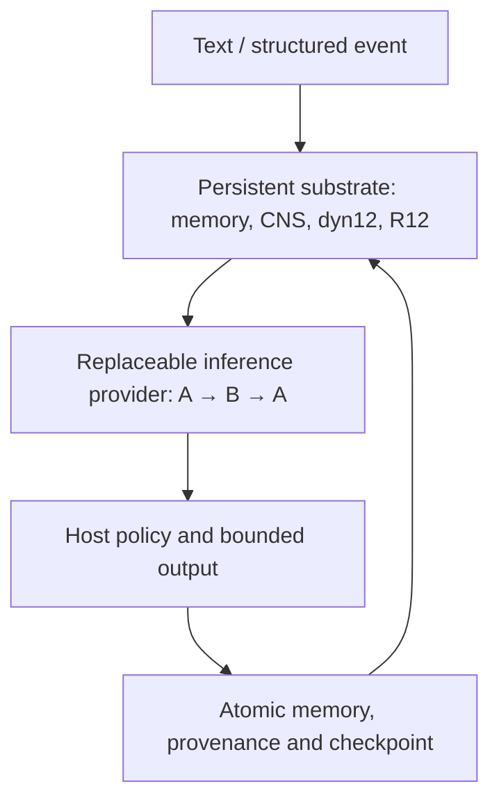

# BEAST BOX // COSMIC.CYPHER

> **Build the loop. Instrument the loop. Move the state. Preserve the nulls. Keep authority explicit.**

**Swap the brain. Keep the story.** Your AI history can live outside the model.
Beast Box is a local-first runtime for persistent memory, software state, routing
and provenance behind replaceable inference adapters. Models supply inference;
the runtime retains the story and enforces its own authority boundary.

**MODEL ≠ MEMORY · MODEL ≠ STATE · MODEL ≠ PROVENANCE · MODEL ≠ AUTHORITY**

The [Hugging Face Genesis integration](docs/BEAST_AWAKENS_HF_INTEGRATION.md) connects learned local memory to the existing Beast behavior core, with pinned source receipts, a controlled memory ablation and replayable traces. One QBEAST; optional brains; no live quantum link.

## Feed the Beast 🐉

This workshop runs on stardust, code, caffeine, and alarming persistence.
Meet the **[Living Support Shrine](https://www.beastboxcosmos.xyz)**: tap the little
Beast for optional support, creature reactions, and tiny interaction-only chirps.

**Monthly Companions:** [Pocket Spark — $5/month](https://buy.stripe.com/3cIbJ27zN7kO8mN97pa7C01) · [Beast Keeper — $15/month](https://buy.stripe.com/fZueVe5rF7kO9qR3N5a7C02) · [COSMOS Builder — $50/month](https://buy.stripe.com/3cI28s2ft7kO6eF0ATa7C03) · [Universe Patron — $150/month](https://buy.stripe.com/6oU00kaLZax0eLb5Vda7C04)

**One-Time Fuel:** [Feed the Beast — $10](https://donate.stripe.com/cNiaEY4nBcF87iJ1EXa7C05) · [Compute Burst — $50](https://donate.stripe.com/3cI8wQ8DRbB446x5Vda7C06) · [Hardware Rune — $100](https://donate.stripe.com/4gM00kdYb5cG8mN0ATa7C07) · [Launch Fuel — $500](https://donate.stripe.com/fZu7sM4nB20u0UlfvNa7C08)

Also: **[GitHub Sponsors](https://github.com/sponsors/NavisWORLD)** · **[Buy Me a Coffee](https://buymeacoffee.com/Cosmic_syanpse)**.
Support funds hosting, compute, storage, hardware, games, experiments, documentation,
and development time. Support is optional. Curiosity is free. It provides no equity,
ownership, investment returns, or guaranteed feature delivery. Cosmetic reactions
never change QBEAST identity, model authority, or scientific results. Opening
checkout is not payment confirmation.

[Beast Wings integration](#beast-wings-integration-october-2026) · [Download Beast Box v0.7.0](https://github.com/NavisWORLD/The-beast-box-/releases/tag/v0.7.0) ·
[COSMIC browser guide](docs/COSMIC_UI_GUIDE.md) · [5-minute Quickstart](docs/QUICKSTART.md) · [Combined Kit / EnD](kits/BEAST_BOX_COMBINED/EnD) · [Exact replica](replica/README.md) ·
[Architecture](docs/ECOSYSTEM_MANIFEST.json) · [Persistent Memory](docs/PORTABLE_STATE.md) ·
[Model Swap Evidence](docs/PERSISTENT_SUBSTRATE_MODEL_SWAP_002_FINAL_REPORT.md) ·
[Provider Setup](docs/PROVIDER_SETUP.md) · [Synapse Flash / Portable State](docs/PORTABLE_STATE.md) ·
[Security](SECURITY.md) · [Threat model](docs/THREAT_MODEL.md) · [Optional external anchor](docs/TRUSTED_ANCHOR.md) · [Configured model routing](docs/MODEL_ROUTING_SCOPE.md) · [Versioned V1/V2 source](docs/VERSIONING.md) · [Scientific Boundaries](docs/CLAIM_BOUNDARIES.md) ·
[Evidence Index](docs/EVIDENCE_INDEX.md) · [Developer Guide](docs/DEVELOPER_GUIDE.md) ·
[Runtime performance measurements](docs/performance/ASTRA_PASS_2026-09-12.md) ·
[Cosmic Fruit Fly 🪰 — experimental workspace](cosmic%20fruit%20fly/README.md)

Download the combined ZIP for checked Python installers, or choose the labelled
platform executable/preview. Start in reference mode, then connect an installed
Ollama model. The [frozen A→B→A report](docs/PERSISTENT_SUBSTRATE_MODEL_SWAP_002_FINAL_REPORT.md)
and source-bound release receipts show what was measured. [Launch demos and FAQ](docs/LAUNCH.md)
explain what those results do and do not mean.

[](https://github.com/NavisWORLD/The-beast-box-/actions/workflows/ci.yml)
[](https://github.com/NavisWORLD/The-beast-box-/actions/workflows/product-ci.yml)
[](https://github.com/NavisWORLD/The-beast-box-/actions/workflows/cypher-smoke.yml)
[](https://github.com/NavisWORLD/The-beast-box-/actions/workflows/rust.yml)
[](https://huggingface.co/phera-ra/QC67_cosmo)
[](https://doi.org/10.5281/zenodo.17574447)

The Beast Box is the installable public **COSMOS / Davis Cosmic Synapse Theory** software distribution. It packages a source-grounded CST state/attention reference, persistent Reconciliation Memory, Hebbian associations, the seven-role CNS, sensory/bio summaries, heartbeat/slow state, continuity experiments, causal controls, optional IBM Quantum transport/provenance tools, a Rust CST workspace, **COSMIC.CYPHER**, and the current durable-runtime / portable-kit surfaces.

The project keeps one systems invariant visible:

```text
STATE MAY TRAVEL.
INFORMATION MAY TRAVEL.
AUTHORITY DOES NOT TRAVEL AUTOMATICALLY.
```

The early cosmic/frequency language is preserved as historical theory/simulation material. The modern software claims are narrower and testable: persistent memory, software state, routing, provenance, recovery, bounded authority, and model replacement are engineering properties measured separately from speculative physical claims.

> A local-first, inspectable adaptive-agent runtime and experimental integration platform with persistent memory, software state, routing, provenance, and authority boundaries outside replaceable inference models.


**Python 3.10–3.12. No IBM account, cloud credential, GPU, or language model is required for the deterministic reference path.** In this Apache-2.0 revision, original Cory-owned software and documentation are licensed **Apache-2.0** under [LICENSE](LICENSE), except individually marked material. See [LICENSE_HISTORY.md](LICENSE_HISTORY.md) and [NOTICE](NOTICE) for scope and earlier releases.

## Beast Wings integration (October 2026)

**This is an update to the existing COSMOS / CST architecture, not a replacement for it.** The persistent substrate, native model artifacts, research history, source-bound receipts and original safety boundaries remain intact. The current source connects more of the previously separate software layers, while deployment and hardware checks retain their own status.

### The connected host path

The [closed-loop/Unicode integration](docs/COSMOS_CLOSED_LOOP_UNICODE_INTEGRATION_012.md) ([PR #161](https://github.com/NavisWORLD/The-beast-box-/pull/161)) adds an **explicitly host-enabled** connected turn:

```text
Permissioned event / owner text
  → validated UTF-8 / optional Unicode NFC
  → existing SYNAPSE and seven-role CNS (dyn12 / dyn42 / dyn54)
  → hash-bound, software-only R12 state transition
  → current-memory R12 retrieval / optional host-reviewed routing
  → selected replaceable inference provider
  → host authorization / bounded outputs
  → atomic memory + Hebbian update + provenance + checkpoint ↺
```

This uses the existing `DurableRuntime`, not a new substitute brain. Its old behavior remains the default; the connected R12/Unicode profile requires matching trusted-host opt-in and verified checkpoint compatibility. **MODEL ≠ MEMORY · MODEL ≠ STATE · MODEL ≠ AUTHORITY.** Unicode-safe host transport does not upgrade each native model's learned tokenizer, language ability or context length.

[PR #162](https://github.com/NavisWORLD/The-beast-box-/pull/162) adds checkpoint-backed `substrate-signal-v1` measurements to the COSMIC **SIGNALS / SYNAPSE TRACE** surface. Missing measurements display as unavailable rather than invented. The separate `beastbox runtime activate` experiment uses **reference fixtures**, not live multi-model inference; see its [recorded limits](docs/experiments/COSMOS_SUBSTRATE_ACTIVATION_007_RESULTS.md).

[PR #164](https://github.com/NavisWORLD/The-beast-box-/pull/164) adds a separately stopped-by-default, host-owned [bounded activation queue](docs/ACTIVATION_QUEUE_013.md) with durable task receipts, restart reconciliation and persistent emergency stop. An interrupted turn can require reconciliation: this is **at-least-once**, not guaranteed exactly-once execution. It does not grant model-directed tools, uncontrolled autonomy or physical sensor authority.

### Beast Wings app and consented sensory inputs

The [installable COSMIC browser app](docs/BEAST_WINGS_FRONTEND_ONLY_RELEASE.md) ([PR #166](https://github.com/NavisWORLD/The-beast-box-/pull/166)) is an iPhone-friendly **Add to Home Screen** web app, not an App Store binary. The public frontend release has an [independent no-credential production smoke receipt](https://github.com/NavisWORLD/The-beast-box-/actions/runs/36796996434). That check does not authenticate an owner chat or test physical microphone/camera hardware.

The browser's **permissioned camera and microphone surfaces** have explicit capture/stop handling and [sensory trust controls](docs/BEAST_WINGS_SENSORY_TRUST.md). Stop clears unsent selected observations and local capture; a privacy stop also prevents late-granted permission requests from silently reattaching tracks. These controls do not revoke browser/OS permissions, erase past durable records or preempt an already-running external inference request. The CLI `sensor-demo` remains a synthetic/normalized-event demo; do not confuse it with real hardware capture or instrument-grade provenance.

[PR #165](https://github.com/NavisWORLD/The-beast-box-/pull/165) merged the **owner-only backend source** for bounded activation, master privacy stop and associated UI/bridge handling. Public and guest interfaces do not acquire owner task authority. The queue stays stopped until a trusted host enables it; no automatic unattended-agent claim follows from source integration.

### Real-model evidence and its limits

The historical [frozen A→B→A continuity evidence](docs/PERSISTENT_SUBSTRATE_MODEL_SWAP_002_FINAL_REPORT.md) remains preserved. Newer, separate [offline two-pretrained-model receipts](docs/experiments/BEASTBOX_ZERO_API_REAL_MODELS_002_RESULTS.md) and the [original native RAWRPHØS 14K → SmolLM2 → same RAWRPHØS receipts](docs/experiments/BEASTBOX_ZERO_API_ORIGINAL_NATIVE_003_RESULTS.md) document genuine locally loaded CPU inference, preserved hash-tracked substrate identity, and **zero paid inference API calls during the measured isolated workloads**. Downloads happened before measured network isolation; electricity and total hosting cost were not measured.

The original-native test established actual prompt-context delivery and checkpoint continuity across model replacement; it **did not** establish reliable returning-model answer generation or successful faithful autonomous task completion. Stable native RAWRPHØS **14K** and experimental **18K** are distinct checkpoints. Original PHOS and SAMGO identities are preserved. Available source adapters or model names are **not** proof that every configured model is currently loaded, healthy or generating in production.

### Deployment and verification boundary

- **Repository:** the connected loop, signal receipts, bounded queue, web app and owner backend changes above are merged into `main`. The [read-only COSMOS CONNECT / MCP site](https://github.com/NavisWORLD/The-beast-box-/pull/167) remains a **separate open PR**, not an installed ChatGPT plugin.
- **Frontend:** the installable frontend's public production marker and anonymous protections were independently smoke-tested. Owner-authenticated model inference and end-to-end on-device capture need separate receipts.
- **Railway:** its deployment listing on **1 October 2026** reported `SUCCESS` for source commit `e9442ed3491cece8add50eb9f7f798bc38e1fc62`. Deployment status alone does **not** certify native-model readiness, sensor delivery, activation behavior, owner-memory continuity, or a verified production rollback. The [private production recovery runbook](docs/BEAST_WINGS_PRIVATE_RECOVERY_RUNBOOK.md) defines the required owner-volume backup, companion-state inventory and isolated-restore checks before enabling migrated closed-loop/Unicode behavior on existing owner data.

**Scientific boundary:** this release is connected stateful **software**, not verified consciousness, biological life, AGI, superintelligence, physical sensing accuracy, novel 12D advantage or reliable model self-correction. The [negative controls and results](docs/CLAIM_BOUNDARIES.md) are not overwritten by integration work. [Synapse OS](https://github.com/NavisWORLD/Synapse-os-) remains a separate operating-system product with its own VM and hardware acceptance.

## Open your cosmic workstation

```bash
beastbox-cosmic --data-dir ./my-beast --port 8081
```

After installing the current source or its built wheel, open
`http://127.0.0.1:8081` on the same computer. ORBIT, BRAIN BAY, MEMORY VAULT,
SYNAPSE TRACE, FILES, WORKSPACE and STORAGE share the real durable substrate.
Choose explicit file lifetimes; repository writes need separate grants.
Changing brains revokes authority while preserving the story.
[Start here: browser, providers, privacy and portable continuity](docs/COSMIC_UI_GUIDE.md).
Older release downloads may predate this browser completion; package version
alone does not identify these source changes.

## What the model does

The language model supplies inference: it receives selected context and returns text or a bounded tool request. Memory, CNS/software state, R12 context routing, Hebbian associations, provenance and continuity checkpoints belong to the runtime. A provider change replaces inference without replacing those stores.


```mermaid
flowchart TD
  E["Text / structured event"] --> S["Persistent substrate: memory, CNS, dyn12, R12"]
  S --> M["Replaceable inference provider: A → B → A"]
  M --> P["Host policy and bounded output"]
  P --> C["Atomic memory, provenance and checkpoint"]
  C --> S
```

**MODEL ≠ SUBSTRATE. MODEL REPLACEMENT ≠ AUTHORITY TRANSFER. PERSISTENCE ≠ CONSCIOUSNESS.**

## Run locally

```bash
git clone https://github.com/NavisWORLD/The-beast-box-.git
cd The-beast-box-
python -m venv .venv
# Linux/macOS: source .venv/bin/activate
# Windows: .venv\Scripts\activate
python -m pip install -e .
beastbox runtime init --data-dir ./my-beast
beastbox runtime chat "Remember the sunflower code is marigold" --data-dir ./my-beast
beastbox runtime chat "What is the sunflower code?" --data-dir ./my-beast
beastbox runtime inspect --data-dir ./my-beast
```

Each command starts a new process. `inspect` validates the checkpoint chain and memory/association digest and reports persistent system ID, memory counts, state hash and provenance head. Missing or corrupt required state fails closed. A failed provider call rolls back the entire turn. `ReferenceTextProvider` is a deterministic text fixture, **not a pretrained language model**.

For an already installed model served by local Ollama:

```bash
beastbox runtime chat "Recall the sunflower code" --data-dir ./my-beast \
  --provider ollama --model YOUR_INSTALLED_MODEL --url http://127.0.0.1:11434
```

Run again with another installed model, then the original model. Keep the same `--data-dir`. Configured provider labels are recorded; this interactive path does not attest model-weight hashes. Exact frozen-model identities belong to the separate historical experiment below. Ollama stays loopback-only. The compatible adapter permits explicitly authorized HTTPS remote endpoints; URL credentials, redirects and environment proxies remain forbidden.

The existing [COSMIC.CYPHER](docs/COSMIC_CYPHER.md) tooling also supports GGUF, LM Studio and llama.cpp. Its conversation/coding persistence is a separate legacy surface; use `beastbox runtime` for the transactional continuity contract described here.

## Exact replica

[Phera's Beast Box replica kit](replica/README.md) rebuilds this repository on a fresh Debian or Ubuntu machine and checks doctor, the cosmic smoke test, the E1–E20 gauntlet, both pytest suites, Rust, and the HTML tests. From this checkout the kit uses the checkout it lives in. `--clone` still builds the pinned v0.7.1 commit instead. Optional `--with-ollama` installs a user-local CPU Ollama under the kit home, and the dashboard can switch brains through Cosmic while memory stays on the substrate.

```bash
./replica/setup.sh
./replica/setup.sh --with-ollama --ollama-models "qwen2.5:1.5b"
./replica/run.sh start
```

Cosmic UI is on port 8081, the RAWRPHØS server on 8767, and the dashboard on 8090. The virtualenv, checkpoint, Ollama files, and loopback API key stay under `~/.beastbox-replica`, outside this repository.

## Sensors, tools and recovery

```bash
beastbox runtime sensor-demo --data-dir ./my-beast
beastbox runtime tool-demo --data-dir ./my-beast
beastbox runtime tool-demo --allow-simulated-tool --data-dir ./my-beast
beastbox runtime backup ./beast-backup.sqlite3 --data-dir ./my-beast
beastbox runtime restore ./beast-backup.sqlite3 --sha256 BACKUP_HASH --data-dir ./recovered-beast
beastbox runtime inspect --data-dir ./recovered-beast
```

The first tool demo is denied. The second permits only a numeric simulated position update; it has no physical, shell, credential or network authority. Permission is supplied by the host for that invocation and is never restored from memory. Normalized events accept text and up to 16 finite numeric features in `[-1, 1]`, with explicit synthetic provenance. They do not capture audio, cameras or people.

Back up through the CLI so SQLite WAL data is included. Restore requires a verified hash and a fresh directory, validates the copied checkpoint, and never overwrites existing history. Retain the backup hash separately. Hashes detect corruption; they are not signatures and cannot defeat a host that rewrites both data and receipts.

## COSMOS Lab — real self-correction and 12D controls (29 September 2026)

**[View the public research results on Beast Box](https://beastboxcosmos.xyz/research)**.
Both requested experiments were executed on actual native/public model checkpoints or independently trained original native code, with immutable receipts, explicit negative controls and all unfavorable results retained:

- **Generative self-correction:** blinded, model-originated self-critique on eight frozen synthetic problems produced **0/8** correct for RAWRPHØS 18K and **3/8** for separately pretrained Qwen 0.5B, the **same as their independent first answers**. No wrong-to-right corrections were observed. Giving Qwen the actual answer produced **5/8**, a separately labeled *answer-disclosure* control, **not** intrinsic self-correction. [Full report](docs/experiments/COSMOS_SELF_CORRECTION_005_RESULTS.md) · [Real original-checkpoint CPU run](https://github.com/NavisWORLD/The-beast-box-/actions/runs/36592111897).
- **Novel 12D advantage:** three independently trained native attention configurations started from identical tensor weights and received the same synthetic training episodes, minibatches and optimizer budget on three fixed seeds. Native dyn12 heldout test accuracy averaged **28.9%** versus **31.1%** for independently trained standard attention and **30.7%** for trained shuffled-state control. The predefined primary advantage test **failed**. An exploratory four-binding sequence-length shift returned **27.9%** for dyn12 versus **22.1%** standard; one tiny synthetic task with unequal active parameter/FLOPs remains insufficient to establish general benefit. [Full report](docs/experiments/COSMOS_DYN12_CONTROLLED_006_RESULTS.md) · [Real three-seed CPU run](https://github.com/NavisWORLD/The-beast-box-/actions/runs/36591525286).

**Release boundary:** merging and publishing these research results does **not** train or promote a new production model, grant autonomous model authority, demonstrate reliable self-correction or prove a novel intelligence advantage. The evidence is public, original weights remain preserved and production inference is unchanged.

## Substrate activation 007

`beastbox runtime activate --data-dir ./activation-run` executes the existing durable loop and writes a receipt. The COSMIC **SIGNALS** view reads those receipt values: 12D state, Hebbian association counts, routing ids, the configured provider label, and the authorization decision. A reference-fixture label sequence A → B → C → A is a fixture rotation, not a verified language-model swap. The 12D advantage and blinded self-correction experiments were not rerun; their published negative results still stand. [Activation results](docs/experiments/COSMOS_SUBSTRATE_ACTIVATION_007_RESULTS.md).

## What was verified

The separate frozen-model experiment **002 historical-4e53** recorded real Model A → Model B → Model A inference with the same hash-tracked substrate, cross-swap memory delivery, state accumulation, zero model-parameter drift, and A-only, empty-memory and shuffled-memory controls.

- [Final report and precise interpretation](docs/PERSISTENT_SUBSTRATE_MODEL_SWAP_002_FINAL_REPORT.md)
- [Executed source bd4108a](https://github.com/NavisWORLD/The-beast-box-/commit/bd4108ac2f245262a25fd80463e84d9279eeead2)
- [Successful run 33914200592](https://github.com/NavisWORLD/The-beast-box-/actions/runs/33914200592)
- Model A checkpoint SHA-256: `454f3017618a81fb9a13393b215d448f365534baf5b607e19d1438955921e425`
- Model B: `HuggingFaceTB/SmolLM2-135M@4e53f736cbb20a9a0f56b4c4bf378d9f306ff915`
- Classification: `COMPLETED_DESCRIPTIVE_MEASUREMENT`

Verify the preserved ZIP without rerunning expensive inference:

```bash
beastbox runtime verify-swap-receipt evidence/system-closure-001/historical-swap-002.zip
```

The verifier checks exact archive, manifest and result hashes plus recorded source/run identity and structural gates. The source model/world binaries are external artifacts named in the report; the receipt ZIP does not contain their weights or re-execute their behavior. Successful memory delivery is not a claim of improved semantic recall. Experiment 001's missing seed provenance and the unavailable Model-B revision `816ebadd0c024779e6657fdcfc1ab02bb9a7c473` remain historical failures.

## Cosmic Fruit Fly 🪰 (experimental)

[Open the `cosmic fruit fly/` research workspace](cosmic%20fruit%20fly/README.md).
The landing page tracks the intended biological-connectome/CST experiment. Its full
biological-data execution, controls, and scientific evidence are **not yet
verified on `main`**; do not interpret the workspace as a completed study.

## Product and research boundaries

| Layer | Supported boundary |
| --- | --- |
| COSMOS / CNS / dyn12 | Existing public software-state loop with persistent checkpoints |
| Hebbian / R12 | Existing association updates and context ranking; routing state is software metadata |
| Synapse / HEARTLIGHT | Orchestration and continuity responsibilities mapped onto this runtime; separate formal products remain interfaces/future work |
| Knowledge/world store | Existing experimental R12 world store, separate from the normal conversation database |
| Zeref | Checkpoint and conversation-experiment lineage |
| Bio, entropy, IBM/quantum | Optional experimental adapters; explicitly enabled input paths |
| Browser camera/microphone / physical actuators | Separately permissioned browser capture is present; CLI reference path is synthetic, live physical-device acceptance is distinct, and physical actuators are not implemented |

The [machine-readable map](docs/ECOSYSTEM_MANIFEST.json) gives actual source paths and labels. Existing higher-dimensional state variants remain experimental instrumentation. This software does not establish consciousness, sentience, biological life, personal identity, resurrection, a soul, quantum advantage, extra physical dimensions or new physics. Generated prose is not scientific evidence.

The **R12 Reality Memory Expansion** remains documented in the [R12 manual](docs/ZEREF_R12_REALITY_MEMORY_MANUAL.md). Its historical phrase **forever memory** describes a retention goal for owner-maintained durable records, not guaranteed indefinite storage or biological continuity.

Historical classifications remain `ENGINEERING_ISOLATION_VERIFIED_CAUSAL_RESOURCE_SOURCE_NOT_ESTABLISHED` and `ENGINEERING_CONTROL_INCONCLUSIVE`. Nulls, failures and rejected descendants are preserved. See [claim boundaries](docs/CLAIM_BOUNDARIES.md) and [claim audit](docs/CLAIM_AUDIT.json).

## Developer gates

```bash
python -m pip install -r requirements-dev.txt
# Full research tests need CPU PyTorch; normal runtime does not.
python -m pip install torch==2.6.0 --index-url https://download.pytorch.org/whl/cpu
python -m pytest -q
make quality
bash scripts/smoke/install-and-run.sh
bash scripts/smoke/sealed-evidence-guard.sh
bash scripts/security-audit.sh
python scripts/run_architecture_acceptance.py --output ./architecture-receipt.json
```

The combined kit includes the public API/configuration and recovery instructions in [EnD](kits/BEAST_BOX_COMBINED/EnD). [Readiness](docs/closure/READINESS.json) records measured gates and limitations. The classification is **release-hardened experimental software** only after the release gates pass; the repository does not claim universal production readiness. [Trust boundaries](docs/TRUST_BOUNDARIES.md) explain host plugins, authority and privacy.


### Portable kit and apps

The **v0.7.0 prerelease** is the current published GitHub Release. It was built
from exact source commit `97f153225ea2f8910f1c91194a65b97f94246c2b`, passed the
source-bound release gates, and then passed the clean public stranger-download
smoke after publication. [Download v0.7.0](https://github.com/NavisWORLD/The-beast-box-/releases/tag/v0.7.0).

Version **0.7.0** adds optional AES-256-GCM sealed storage, isolated local
profiles, restored conversation on desktop/COSMIC restart, signing-ready
Android/iOS metadata, the standalone `/html/` browser client in the public kit,
and source-bound checksums/packages for the published artifacts. The public
stranger smoke anonymously re-downloads the release, verifies checksums, installs
the wheel outside the repository, and exercises restart continuity, portable
export/import, tamper rejection, authority denial, and both browser surfaces.

The installers support Python 3.10–3.12; separately packaged desktop executables
bundle Python. Android is published as a sideload candidate unless a real release
keystore is supplied. iOS device distribution still requires Apple signing and
physical-device/TestFlight work. The historical v0.6.0 release remains available
for reproducibility; see [0.6.0 release notes](docs/closure/RELEASE_NOTES_0.6.0.md).

[Optional inputs](docs/OPTIONAL_INPUTS.md) documents user-owned IBM/Azure setup,
explicit cloud-job permission, local PCM WAV input and measured light summaries.
Use `beastbox runtime resource-status` to inspect configuration without revealing
keys. Audio extraction is local; light input accepts numerical measurements and
does not acquire camera footage or identify people. Azure's bounded path targets
`ionq.simulator`; it does not claim Azure hardware execution.

[Android](apps/android/README.md) and [iOS](apps/ios/README.md) embed the actual
Python durable runtime. Mobile acceptance uses explicitly labelled reference
fixtures, not bundled LLM weights. iOS device distribution needs Apple signing
and the placeholders in `apps/ios/ExportOptions.plist`. Android release signing
uses `BEASTBOX_ANDROID_KEYSTORE` when supplied; otherwise CI produces a debug
sideload APK, not a Play Store release.
[Native C++/Rust clients](sdk/runtime-client/README.md) expose the runtime through
versioned JSON. They are clients, not ports of the entire runtime to those languages.

[Synapse OS](https://github.com/NavisWORLD/Synapse-os-) is a separate Linux
product with C/C++/Rust SDKs and its own hardware acceptance requirements. The
[QBT apps](https://github.com/NavisWORLD/Quantum-azure-ibm-bridge-attachment-/releases/tag/v0.4.0)
are separate quantum-bridge clients, not evidence that every Beast feature runs on
all phones. Persistent memory survives supported restarts and provider changes;
uninstalling, clearing data, disk failure or exhausted storage can destroy it.
Keep independently verified backups. There is no unconditional forever guarantee.
