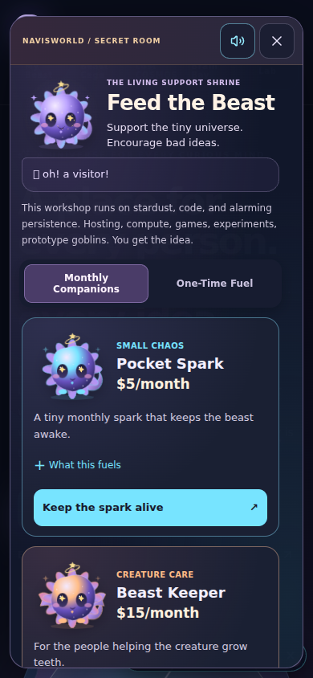
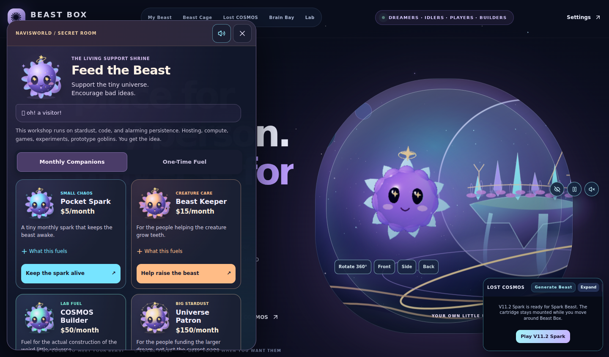

# Living Support Shrine — implementation and verification

Audited the existing support widget at `8e488ae242bf3a4417ff5ba34c4daae3f1804d4e`,
then incorporated current main `b1f1edbcc0abbcfb4df79717a487dc66f00e7253` before
the final build. The newer Lost COSMOS pad/keyboard bridge and Start cartridge
changes are preserved. This is an evolution of the existing support companion.

## What changed

| Part | Implementation |
| --- | --- |
| Registry | `lib/support-tiers.ts`: eight exact public routes, USD cents, recurring/one-time labels, copy, mascot, reaction, particles and sound |
| Shrine | Existing `components/cosmic-support-widget.tsx`: floating guide, petting, bounded stardust, two tabs, four mounted cards at a time |
| Creature art | `components/support-mascot.tsx`: shared original galaxy/petal body and star eyes; wings, halo, bowl, capacitor, goggles, chip and launch platform are cosmetic props |
| Cards | `components/support-tier-card.tsx`: one shared implementation; readable price, optional funding description, pet button and real checkout anchor |
| Sound | `lib/support-audio.mjs`: eight short signatures on the existing Beast SFX bus; no new AudioContext or music system |
| Existing audio | Handle rejected native `resume()` promises so optional audio cannot create an unhandled rejection |
| Mobile | Single card column, contained panel scroll, sticky tabs/tools, safe-area and dynamic viewport height; launcher stays clear of the cartridge dock |
| Accessibility | Semantic links/buttons, 44px or larger controls, keyboard tabs, Escape/close, focus restoration, polite feedback and reduced-motion static states |
| Persistence | Only the versioned support mute preference is written. Existing session/profile name is read only; no adoption, identity, evolution, model or scientific-state writes |
| Documentation | Concise README route map, current profile support map and this report |

The original `public/cosmic-creature.svg`, funding configuration, home page,
Beast Cage, Brain Bay, Spark generation, QBEAST save/export and game architecture
are retained. The dialog uses a body portal because the landing artwork creates
a stacking context; the existing game dock otherwise intercepts its controls.
The support guide sits on the left so the collapsed launcher does not cover the
bottom-right game dock. No checkout button moves with creature animation.

## Payment and scientific boundaries

All eight routes are separate existing Stripe Payment Links. No product, price,
link, customer, payment or webhook was created or modified. The
[dated live catalog receipt](support-shrine/stripe-route-audit.json) records active
live links, single line items and the exact USD prices/recurrence. The eight
Stripe routes, Sponsors and Buy Me a Coffee also returned HTTP 200 during the
audit; that response is not proof of a completed payment.

Clicking a link says **“Opening cosmic fuel portal…”**. Reserved verified-success
copy is not rendered. There is no checkout-success inference from a query string,
return navigation, local storage or button click. Future confirmation requires
authenticated server-side Stripe evidence. No payment was submitted during testing.

Support is voluntary. It grants no equity, ownership, investment returns,
guaranteed feature delivery, creature intelligence, quantum traits, scientific
validation or authority. Petting, sounds and stardust are UI effects. Simulation
is not measurement; seeded generation is not QPU hardware; continuity is not
consciousness; MODEL ≠ MEMORY ≠ STATE ≠ AUTHORITY.

## Verification

- `npm test`: **211 tests, 205 passed, six existing skips, zero failures**.
- `npm run typecheck`: passed.
- `npm run build`: passed against the refreshed main branch.
- Owner bridge security suite: **46 tests passed**.
- Production Chromium: **1440px, 390px, 430px, and 390px reduced motion passed**.
  The mobile runs use actual touch events. Checks cover four cards per tab, all
  eight destinations/prices, sounds after interaction, no autoplay, persisted
  mute, no horizontal overflow, visible close, keyboard tabs, focus restoration,
  unchanged canonical local state and departure-only payment feedback.
- Existing desktop/mobile/tablet browser acceptance passed with no console errors:
  public journey, owner authentication, offline gate, memory honesty, image staging
  and fail-closed BYOK settings.
- Beast Cage's real browser suite passed at 1440, 430, 390, 375 and 320px,
  including reduced motion. Its homepage check now uses the intentionally updated
  heading; Cage identity, local save, game dock and genuine 3D checks remain.
- The real native handoff suite passed: the same QBEAST entered the cartridge,
  touch and Gamepad API controls reached its native core, care/chat stayed shared,
  and chat did not remount the game. The existing strict press/release assertions
  remain. Investigation found the field's keyboard fallback and controller bridge
  forwarded duplicate edges; the player now forwards each transition once.
  Local diagnostics used the hash-verified public V11.3 cartridge release
  `6f9c22fa22b32694d606c854b4da26b4394b2ecaa86842cc1998c8cfe57b1fb3`.
  CI builds the pinned original source independently.
- Profile validator passed: **18 SVGs parsed, 17 local image references checked**.
- `git diff --check`: passed. No lint command is configured in this app.

Four source assertions were already failing on audited main before these changes.
They expected removed homepage/nav strings and disabled main deployments.
They now assert the current intentional public routes and main deployment contract;
guest/owner authority checks remain. The legacy browser test now waits for the
Cage navigation rather than checking the destination heading synchronously.

This is Chromium at iPhone-like widths, **not physical iPhone Safari verification**.
WebKit could not run because its system libraries are unavailable in this managed
environment. Do not label that as a Safari pass. Headless checks prove audio was
scheduled and muted; they do not certify a physical speaker's output.

The new art is inline SVG/CSS; particles and oscillator voices are bounded. There
are no new app dependencies, trackers, remote animation libraries, payment SDK,
secret keys, fabricated metrics or canonical creature persistence system.
Support visuals pause when the document is hidden. Screenshot files below are
documentation evidence and are not requested by the application.

## Visual evidence

## Reproduce

From `apps/beastbox-cloud`, run `npm ci`, `npm test`, `npm run typecheck`, and
`npm run build`. Start `npm run start -- --port 3100`, then run
`python tests/support_shrine_browser.py` with Python Playwright and Google Chrome
installed. `SUPPORT_BROWSER_EXECUTABLE` selects an existing Chromium;
`SUPPORT_EVIDENCE_DIR` selects the screenshot/report directory.

The existing browser acceptance requires the public CI-only credentials defined
in `.github/workflows/cosmic-chaos-preview.yml`. Those fixtures must never be used
for a real deployment. CI runs both browser suites and uploads the evidence.
